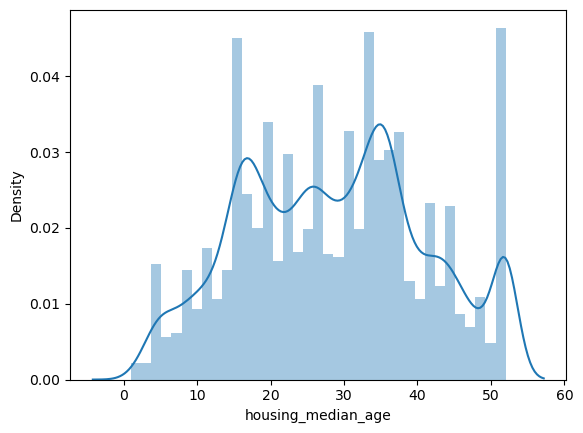

# House Price Prediction in California

## Project Description
This project is to predict the house price in California. The dataset is from Kaggle. The dataset contains 20640 observations and 10 variables. The variables are longitude, latitude, housing median age, total rooms, total bedrooms, population, households, median income, median house value, and ocean proximity. The target variable is median house value. 

## Steps
1. Upload the dataset to AWS S3 bucket and use AWS SageMaker to process the data
2. Data Cleaning: Deal with null values and outliers
3. Exploratory Data Analysis
4. Train Test Split: Split the data into training and testing sets, test size is 30% of the data
5. Train the model using linear regression, RFE, ridge, decision tree, and random forest
6. Test the prediction accuracy

## Columns of dataset
longitude (signed numeric - float) : Longitude value for the block in California, USA
latitude (numeric - float ) : Latitude value for the block in California, USA
housing_median_age (numeric - int ) : Median age of the house in the block
total_rooms (numeric - int ) : Count of the total number of rooms (excluding bedrooms) in all houses in the block
total_bedrooms (numeric - float ) : Count of the total number of bedrooms in all houses in the block
population (numeric - int ) : Count of the total number of population in the block
households (numeric - int ) : Count of the total number of households in the block
median_income (numeric - float ) : Median of the total household income of all the houses in the block
ocean_proximity (numeric - categorical ) : Type of the landscape of the block [ Unique Values : 'NEAR BAY', '<1H OCEAN', 'INLAND', 'NEAR OCEAN', 'ISLAND' ]
median_house_value (numeric - int ) : Median of the household prices of all the houses in the block

## Example

1. Upload the dataset to AWS S3 bucket

2. Use AWS SageMaker to process the data

3. Replace the null values

4. Visualize the data to get a better understanding of the data
   
Visualization example:  

5. Draw the correlation heatmap

6. Train the model using linear regression, RFE, ridge, decision tree, and random forest

Example:

## References

* [rust-cli-template](https://github.com/kbknapp/rust-cli-template)
* [California House Price](https://www.kaggle.com/datasets/shibumohapatra/house-price)
